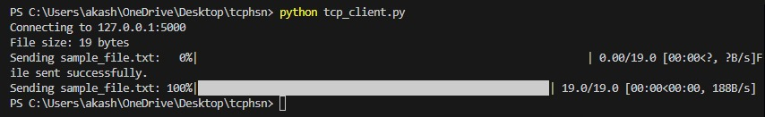
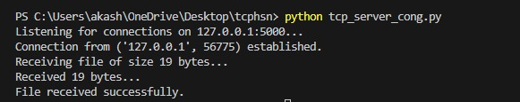
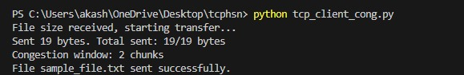
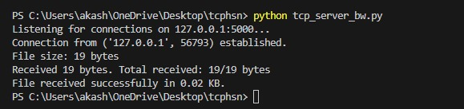
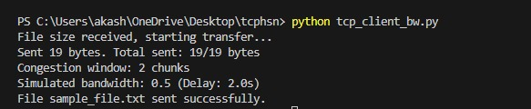
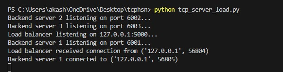
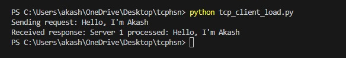

# High Speed Networks TCP Congestion Control with Adaptive Window Sizing

This project demonstrates various aspects of TCP congestion control, including basic communication, congestion control, bandwidth management, and load balancing. It aims to analyze and improve the performance of TCP connections using adaptive window sizing techniques for congestion control.

## Introduction

This project involves multiple segments that simulate different aspects of TCP communication, focusing on congestion control, bandwidth management, and load balancing. By implementing various scenarios with different control mechanisms, the project provides insight into the behavior of TCP connections under different conditions. The goal is to understand how adaptive window sizing can optimize TCP performance, reduce congestion, and improve overall network efficiency.

## Novelties

1. Implementation of TCP congestion control using adaptive window sizing.
2. Simulation of bandwidth management in a TCP connection.
3. Load balancing mechanism to distribute requests among multiple backend servers.
4. Use of multiple segments to simulate different TCP scenarios.
5. Real-time monitoring and acknowledgment of data transfer between client and server.
6. In-depth analysis of TCP congestion control's impact on performance.

## Tech Stack

- Python
- TCP Socket Programming
- Socket Library
- Basic File Transfer Mechanism
- Adaptive Window Sizing Algorithms

## File Format Tree

```
.
├── tcp_client.py
├── tcp_server.py
├── tcp_client_cong.py
├── tcp_server_cong.py
├── tcp_client_bw.py
├── tcp_server_bw.py
├── tcp_client_load.py
├── tcp_server_load.py
├── received_file.txt
├── received_sample_file.txt
├── sample_file.txt
└── screenshot
    ├── output1.png
    ├── output2.png
    ├── output3.png
    ├── output4.png
    ├── output5.png
    ├── output6.png
    ├── output7.png
    └── output8.png
```


## Segment 1: tcp_server.py and tcp_client.py

In this segment, the `tcp_server.py` and `tcp_client.py` files demonstrate a basic TCP client-server communication system. The server listens on a specified IP address and port, waiting for a client to connect. Once a connection is established, the server accepts and processes the data sent by the client. The client, on the other hand, connects to the server, sends a simple request, and waits for a response. This setup simulates a basic communication scenario where data is transmitted in both directions between the client and the server. The system primarily focuses on establishing a reliable connection and handling basic data exchange.

**Commands to Run**:
```
python tcp_server.py
python tcp_client.py
```
**Output**:



---

## Segment 2: tcp_server_cong.py and tcp_client_cong.py

In this segment, the `tcp_server_cong.py` and `tcp_client_cong.py` files introduce the concept of TCP congestion control. The server and client interact in a way that simulates congestion control mechanisms, such as controlling the window size to adjust the flow of data. The server is responsible for receiving the client’s requests, processing them, and sending back a response while implementing congestion control strategies. The client sends data while taking into account congestion signals from the server. This segment tests the ability of the system to handle congestion scenarios by adjusting the flow of packets based on feedback received during the communication process.

**Commands to Run**:
```
python tcp_server_cong.py
python tcp_client_cong.py
```

**Output**:


---

## Segment 3: tcp_server_bw.py and tcp_client_bw.py

In this segment, the `tcp_server_bw.py` and `tcp_client_bw.py` files are designed to simulate a system that controls and monitors the bandwidth usage between the server and the client. The server and client communicate while tracking the data transfer rate and adjusting the window size based on the available bandwidth. This simulation aims to analyze how bandwidth management can optimize the flow of data and reduce congestion, allowing for more efficient network utilization. The focus is on monitoring the rate of data transfer and adjusting the transmission behavior accordingly.

**Commands to Run**:
```
python tcp_server_bw.py
python tcp_client_bw.py
```

**Output**:



---

## Segment 4: tcp_server_load.py and tcp_client_load.py

In this segment, the `tcp_server_load.py` and `tcp_client_load.py` files implement a load balancing mechanism where multiple backend servers handle requests from the client. The load balancer distributes the incoming client requests to different backend servers in a round-robin manner, ensuring even distribution of load. The client sends data requests to the load balancer, which forwards them to one of the backend servers. This setup aims to test the effectiveness of load balancing in optimizing server performance by preventing any one server from becoming overloaded.

**Commands to Run**:
```
python tcp_server_load.py
python tcp_client_load.py
```

**Output**:



---

## My Details

**Akash S**  
[LinkedIn: www.linkedin.com/in/akashnb](https://www.linkedin.com/in/akashnb)  
High Speed Networks
